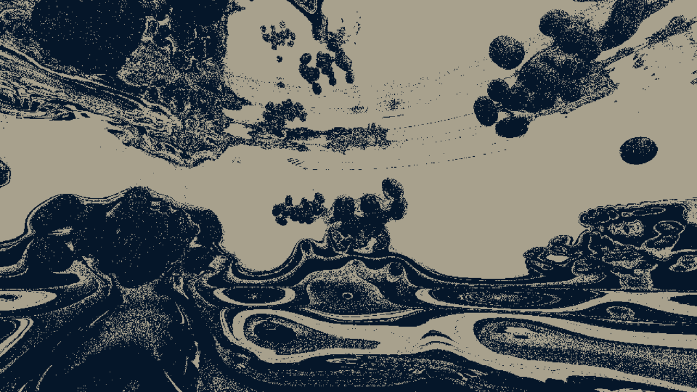

# graffathon-demo

Demo for Graffathon 2026 Advanced compo.



[Play the demo in your browser](https://felixbade.fi/2026/64k-quirks/)

[Watch the recording on YouTube](https://www.youtube.com/watch?v=37PWIm1RvE0&list=PLmRDkQf8W1WFX7ED2q87HncbY_u8ZW3Hm&index=3)


## Build

```sh
npm install
npm run dev      # live reload + parameter explorer
npm run export   # 64kB export path
```

## Dev reflections

- 99% of the code was written by Opus (I only changed some oneliners), and 99% of the parameters were chosen by me.
- [parameter-flow](https://github.com/felixbade/parameter-flow) - live parameter explorer used during the development of thes demo. developed it in parallel with this demo.
- I tried to make a sandbox architecture for different scenes so that one becoming a mess with AI doesn't hurt the others. This seemed to work really well. I feel overall I had an easier time following my codebase than typically when partycoding. perhaps because my brain stayed on the architectural level all the time?
- about 70% of the prompts were related to refactoring. AI can create a huge mess in a few prompts – hygienic scaffolding was critical to sustaining productivity.
- I am not sure if the audio counts as AI generated. I have never managed to wire up more complex stuff with Web Audio API, but after reading the generated code, I learned some new key concepts like `exponentialRampToValueAtTime`. I think the way I vibe coded the synths is *less* cheating than using a DAW, but I feel the demoscene will be disappointed in my approach nevertheless.
- I had so much fun! definitely checks the wellness coding box.

### notes for future me
- do spend "too much" time and care on the parameters handles. once they are wired up, magic will happen.
- do develop tooling at the same time. not only is it fun during the moment and useful later, it also helps have breaks from the artistic creativity.
- do make ambitious refactors. the multi-shader system was only a few prompts, and it unlocked a whole new level of flow.
- the most valuable refactors / tooling UX improvements came when I was really critical about needing a bit too many braincells to keep track of what's going on. for example pflow being hard to navigate without a GUI, or things being too stateful.